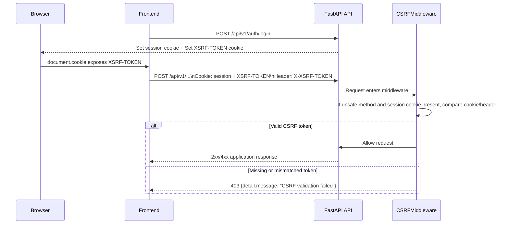
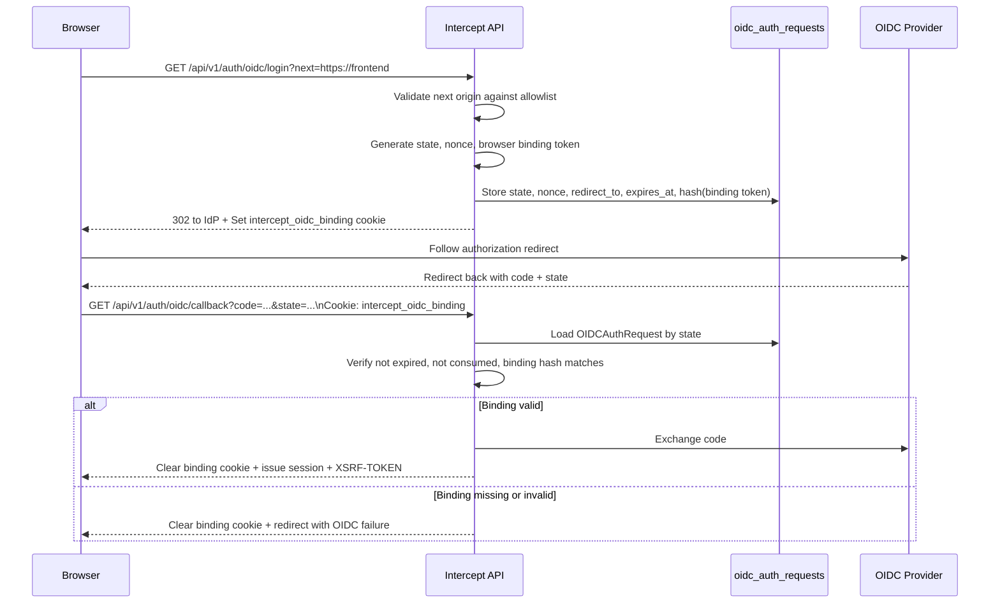

# CSRF Protection

How Intercept protects session-cookie authenticated flows from cross-site request forgery, how the tokens and cookies move through the system, and the implementation constraints that matter when adding new features.

## Overview

Intercept uses session cookies for browser authentication. That means requests can be authenticated automatically by the browser, which creates CSRF risk for any unsafe endpoint that accepts the session cookie.

The protection model now has three layers:

1. SameSite session cookies reduce ambient cross-site cookie sending.
2. A double-submit CSRF token is required for unsafe requests that use session-cookie auth.
3. OIDC login initiation is bound to the originating browser so an attacker cannot complete a login flow into a victim session from a different browser context.

This is implemented across backend middleware, auth cookie helpers, OIDC state handling, and the frontend streaming client.

## Threat Model

The changes are designed to block these practical cases:

- Cross-site `POST`, `PUT`, `PATCH`, and `DELETE` requests that rely on the browser automatically attaching the session cookie.
- Login CSRF / session swapping in the OIDC flow.
- State-changing browser flows implemented as `GET` requests, especially streaming endpoints.

These changes do not try to protect non-browser API clients using bearer tokens or API keys. Those requests are not CSRF-relevant because the browser does not attach those credentials automatically.

## High-Level Design

| Concern | Implementation |
|---------|----------------|
| Session-cookie mutation protection | Double-submit cookie using readable `XSRF-TOKEN` cookie and `X-XSRF-TOKEN` header |
| Enforcement point | `CSRFMiddleware` in [backend/app/core/csrf.py](../backend/app/core/csrf.py) |
| Cookie issuance/revocation | Helpers in [backend/app/api/route_utils.py](../backend/app/api/route_utils.py) |
| OIDC anti-session-swap binding | Short-lived browser-binding cookie plus hashed token stored in `OIDCAuthRequest` |
| Mutable streaming endpoint hardening | LangFlow stream changed from `GET` to `POST` |
| Frontend transport change | `fetch()` streaming replaces `EventSource` so the CSRF header can be sent |

## Request Protection Flow

## Cookie Lifecycle

### Session and CSRF cookies

The auth cookie helpers now issue and revoke the session and CSRF cookies together.

| Event | Cookie behavior |
|------|------------------|
| Password login success | Issue session cookie and readable `XSRF-TOKEN` |
| Passkey login success | Issue session cookie and readable `XSRF-TOKEN` |
| OIDC callback success | Issue session cookie and readable `XSRF-TOKEN` |
| `GET /api/v1/auth/session` success | Refresh `XSRF-TOKEN` |
| Logout success | Revoke both cookies |
| Invalid/expired session response paths | Revoke both cookies |

Important properties:

- The session cookie remains `HttpOnly`.
- The CSRF cookie is intentionally **not** `HttpOnly`, so frontend code can mirror it into the request header.
- The CSRF cookie reuses the session cookie path and security settings.
- CSRF token values are opaque random values generated with `secrets.token_urlsafe(32)`.

## Middleware Rules

The middleware in [backend/app/core/csrf.py](../backend/app/core/csrf.py) enforces CSRF only when all of the following are true:

- The request is an HTTP request.
- `auth.csrf.enabled` is true.
- The method is one of `POST`, `PUT`, `PATCH`, or `DELETE`.
- The request does not use `Authorization` or `X-API-Key` headers.
- The request includes the session cookie.

If those conditions hold, the middleware requires:

- Cookie: `XSRF-TOKEN`
- Header: `X-XSRF-TOKEN`
- Exact constant-time match between the two values

If the request is authenticated some other way, or if there is no session cookie, the middleware does not apply CSRF checks.

## OIDC Browser-Binding Flow

Standard OIDC state validation was not enough for this application because an attacker could potentially initiate an authorization flow elsewhere and then cause the victim browser to consume the callback.

To close that gap, login initiation now creates a second short-lived token that is tied to the initiating browser.

Important details:

- The raw browser-binding token is never stored in the database; only a Blake2b hash is stored.
- The binding cookie is path-scoped to `/api/v1/auth/oidc`.
- The binding lifetime is short, currently 5 minutes.
- The `next` parameter is restricted to configured allowed origins, not arbitrary absolute URLs.

## LangFlow Streaming Change

The LangFlow streaming route used to be a mutable `GET`. That was a CSRF problem because `GET` should not mutate server state, and browser-native `EventSource` does not let the app attach the CSRF header.

The route is now:

- `POST /api/v1/langflow/stream/{session_id}`
- Request body contains the message payload
- Frontend uses `fetch()` streaming instead of `EventSource`

This preserves streaming behavior while allowing:

- session cookies to be sent with `credentials: 'include'`
- `X-XSRF-TOKEN` to be attached explicitly

## Frontend Responsibilities

For session-cookie authenticated browser mutations, the frontend must:

1. Read `XSRF-TOKEN` from `document.cookie`.
2. Send it as the `X-XSRF-TOKEN` request header.
3. Include cookies with `credentials: 'include'` when using `fetch()`.

For generated OpenAPI client calls, this usually means ensuring the shared request layer sends credentials and the CSRF header where needed. For custom browser requests, this is the caller's responsibility directly.

The LangFlow client in [frontend/src/services/langflowApi.ts](../frontend/src/services/langflowApi.ts) is the reference implementation for manual streaming requests.

## Configuration

New relevant settings in [backend/app/core/settings_registry.py](../backend/app/core/settings_registry.py):

| Setting | Default | Purpose |
|---------|---------|---------|
| `auth.csrf.enabled` | `true` | Enables CSRF enforcement for unsafe session-cookie requests |
| `auth.csrf.cookie_name` | `XSRF-TOKEN` | Name of the readable CSRF cookie |
| `auth.csrf.header_name` | `X-XSRF-TOKEN` | Header that must match the cookie |
| `oidc.allowed_redirect_origins` | local dev origins | Allowlist for OIDC `next` targets |
| `oidc.browser_binding.cookie_name` | `intercept_oidc_binding` | OIDC browser-binding cookie name |

The CORS configuration also explicitly allows `X-XSRF-TOKEN` in request headers.

## Key Gotchas

### 1. SameSite is not the whole defense

SameSite helps, but it is not the whole protection model. The backend now enforces an explicit token check for unsafe session-cookie requests.

### 2. `EventSource` is not enough for protected mutations

`EventSource` cannot attach custom headers. Any state-changing browser flow that needs CSRF protection must use a transport that can send `X-XSRF-TOKEN`, typically `fetch()`.

### 3. New mutable browser endpoints must not use `GET`

If a route changes server state, do not expose it as `GET` even if it is convenient for streaming or polling. The right fix is usually to convert it to `POST` or another unsafe method and enforce CSRF.

### 4. Clear cookies on explicit response objects

When a route returns a new `Response` or `JSONResponse`, cookie mutation must be applied to that returned object. Mutating FastAPI's injected `Response` object is not enough if a different response object is actually returned.

### 5. OIDC redirect safety is now origin-based, not merely absolute-URL based

The `next` parameter must resolve to an allowed origin. Adding a new frontend origin requires updating `oidc.allowed_redirect_origins`.

### 6. This protection is scoped to browser session auth

Requests that authenticate with `Authorization` or `X-API-Key` intentionally bypass CSRF enforcement.

## Adding New Features Safely

When adding a new browser-facing mutating endpoint:

1. Use `POST`, `PUT`, `PATCH`, or `DELETE`, not `GET`.
2. Assume the route will be CSRF-protected if it accepts session cookies.
3. If the frontend uses manual `fetch()`, include `credentials: 'include'` and `X-XSRF-TOKEN`.
4. If the route returns a custom response object on auth failure or logout-like behavior, revoke both session and CSRF cookies on that actual response object.
5. If the route initiates an external browser auth flow, consider whether it also needs browser binding similar to OIDC.

## Migration Note

OIDC browser binding adds a `browser_binding_hash` column to `oidc_auth_requests` via [backend/db_migrations/versions/002_oidc_browser_binding_hash.py](../backend/db_migrations/versions/002_oidc_browser_binding_hash.py).

This migration is intended to run through Alembic's revision tracking. It is not written to be manually rerun idempotently outside normal Alembic state management.

## Tests

The current focused coverage for this work lives in:

- [backend/tests/integration/auth/test_csrf_protection.py](../backend/tests/integration/auth/test_csrf_protection.py)
- [backend/tests/integration/auth/test_oidc_flow.py](../backend/tests/integration/auth/test_oidc_flow.py)
- [backend/tests/integration/test_langflow_chat_authorization.py](../backend/tests/integration/test_langflow_chat_authorization.py)
- [frontend/src/services/langflowApi.test.ts](../frontend/src/services/langflowApi.test.ts)

These tests cover:

- rejection of unsafe session-cookie mutations without the CSRF header
- acceptance when the CSRF cookie/header match
- OIDC callback rejection without the browser-binding cookie
- OIDC success when the binding cookie is present
- LangFlow streaming via `POST` with CSRF protection

## Summary

The CSRF model is now:

- explicit token enforcement for unsafe session-cookie requests
- browser-bound OIDC initiation and callback completion
- no state-changing `GET` route for LangFlow streaming

That combination closes the main practical CSRF gaps without changing the app's session-cookie authentication model.