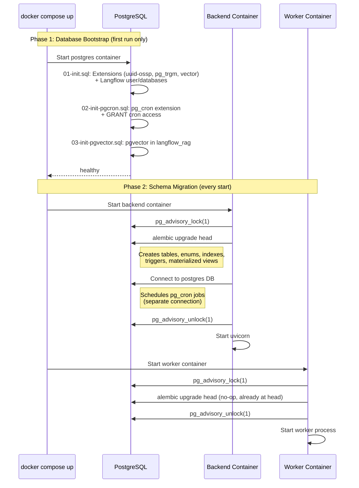
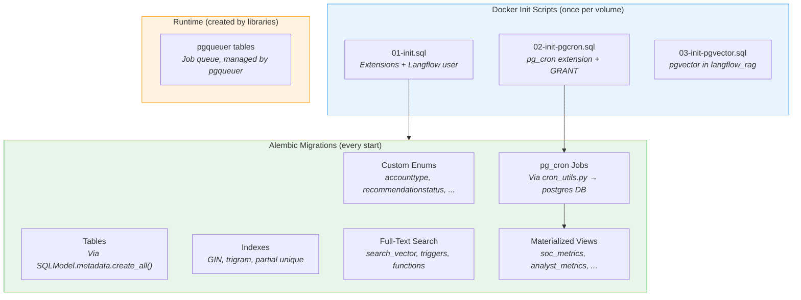

# Database Schema Management

How the Intercept database schema is provisioned, migrated, and maintained across environments.

## Overview

Intercept uses PostgreSQL with a layered initialization strategy:

| Layer | Tool | Runs when | Responsibility |
|-------|------|-----------|----------------|
| **Extensions & users** | Docker init SQL scripts | Once per volume creation | PostgreSQL extensions, Langflow user/databases |
| **Schema** | Alembic migrations | Every container start | Tables, enums, indexes, triggers, materialized views |
| **Scheduled jobs** | Alembic migration (pg_cron) | Every container start | Materialized view refresh, session cleanup |

The key principle: **Alembic is the single source of truth for application schema**. Init SQL scripts only handle PostgreSQL-level prerequisites that must exist before Alembic runs.

## Initialization Flow



### Advisory Lock for Safe Concurrent Migrations

Both the `backend` and `worker` containers run `alembic upgrade head` on startup via [`entrypoint.sh`](../backend/entrypoint.sh). Since they start concurrently, a PostgreSQL advisory lock (`pg_advisory_lock(1)`) prevents race conditions. The first container to acquire the lock runs migrations; the second finds the database already at head and exits immediately.

## What Belongs Where

### Init SQL Scripts (PostgreSQL prerequisites)

Files in `backend/` mounted to `/docker-entrypoint-initdb.d/` in the postgres container. These run **once** when the Docker volume is first created and never again.

| File | Database | Purpose |
|------|----------|---------|
| [`init.sql`](../backend/init.sql) | `intercept_case_db` | Extensions (`uuid-ossp`, `pg_trgm`, `vector`), Langflow user/database creation |
| [`init-pgcron.sql`](../backend/init-pgcron.sql) | `postgres` | pg_cron extension + `GRANT USAGE ON SCHEMA cron` (superuser prerequisites only) |
| [`init-pgvector.sql`](../backend/init-pgvector.sql) | `langflow_rag` | pgvector extension for RAG database |

**Rules for init SQL:**
- ✅ `CREATE EXTENSION` — Extensions must exist before Alembic can use them
- ✅ User/database creation — Cross-database DDL can't be done from Alembic
- ✅ `GRANT` statements requiring superuser — e.g. `GRANT USAGE ON SCHEMA cron`
- ❌ pg_cron job scheduling — Now handled by Alembic migration via `cron_utils.py`
- ❌ Tables, columns, indexes — These belong in Alembic migrations
- ❌ Functions, triggers — These belong in Alembic migrations
- ❌ Application-level enums — These belong in Alembic migrations

### Alembic Migrations (Application schema)

Files in `backend/db_migrations/versions/`. These run on every container start and are idempotent.

**The initial migration ([`001_initial_schema.py`](../backend/db_migrations/versions/001_initial_schema.py)) creates:**

| Step | What | How |
|------|------|-----|
| 1 | PostgreSQL enums | `CREATE TYPE ... AS ENUM` via `op.execute()` |
| 2 | All tables | `SQLModel.metadata.create_all(bind)` |
| 3 | Partial unique indexes | `CREATE UNIQUE INDEX` via `op.execute()` |
| 4 | search_vector columns | `ALTER TABLE ADD COLUMN` via `op.execute()` |
| 5 | Full-text search functions | `CREATE FUNCTION` via `op.execute()` |
| 6 | Search vector triggers | `CREATE TRIGGER` via `op.execute()` |
| 7-8 | GIN indexes | `CREATE INDEX` via `op.execute()` |
| 9 | Trigram indexes | `CREATE INDEX ... USING gin(... gin_trgm_ops)` via `op.execute()` |
| 10 | Materialized views | `CREATE MATERIALIZED VIEW` via `op.execute()` |

**Rules for Alembic migrations:**
- ✅ Table creation (via `SQLModel.metadata.create_all()`)
- ✅ Columns, constraints, indexes
- ✅ Enums, functions, triggers
- ✅ Materialized views
- ✅ Enum value additions (`ALTER TYPE ... ADD VALUE`)
- ✅ pg_cron job scheduling — Via `db_migrations/cron_utils.py` (separate connection to `postgres` DB)
- ❌ Extensions — Must exist before Alembic runs
- ❌ Cross-database DDL — Alembic connects to one database

## Schema Component Ownership



## Writing New Migrations

### Adding a New Table

Define the model in `backend/app/models/models.py` following the SQLModel pattern, then generate a migration:

```bash
conda activate intercept
cd backend
alembic revision --autogenerate -m "add_widgets_table"
```

Review the generated migration carefully. The `include_object` filter in [`env.py`](../backend/db_migrations/env.py) automatically excludes runtime objects (pgqueuer tables, search_vector columns, GIN indexes) to prevent autogenerate noise.

### Adding an Enum Value

Enum value additions cannot be autogenerated. Create a manual migration:

```bash
cd backend
alembic revision -m "add_new_enum_value"
```

Then write:

```python
def upgrade() -> None:
    op.execute("ALTER TYPE myenum ADD VALUE IF NOT EXISTS 'NEW_VALUE'")

def downgrade() -> None:
    # PostgreSQL doesn't support removing enum values
    pass
```

### Adding a PostgreSQL-Specific Index

Indexes that use PostgreSQL-specific features (GIN, trigram, partial) must be created via `op.execute()` and added to the `include_object` exclusion list in [`env.py`](../backend/db_migrations/env.py):

```python
# In migration
def upgrade() -> None:
    op.execute("""
        CREATE INDEX IF NOT EXISTS idx_widgets_name_trgm 
        ON widgets USING gin(name gin_trgm_ops);
    """)
```

```python
# In env.py include_object()
if type_ == "index":
    excluded_index_patterns = (
        # ... existing indexes ...
        "idx_widgets_name_trgm",  # Add new index here
    )
```

### Adding a Materialized View

Materialized views go in Alembic migrations. If they need periodic refresh, schedule a pg_cron job in the same migration using `cron_utils`:

```python
from alembic import op
from db_migrations.cron_utils import schedule_cron_job, unschedule_cron_job

def upgrade() -> None:
    op.execute("""
        CREATE MATERIALIZED VIEW my_view AS
        SELECT ... FROM ...;
        
        CREATE UNIQUE INDEX my_view_idx ON my_view (...);
    """)
    
    schedule_cron_job(
        name='refresh-my-view',
        schedule='*/15 * * * *',
        command='REFRESH MATERIALIZED VIEW CONCURRENTLY my_view;',
    )

def downgrade() -> None:
    unschedule_cron_job('refresh-my-view')
    op.execute("DROP MATERIALIZED VIEW IF EXISTS my_view;")
```

The `cron_utils` helper opens a separate connection to the `postgres` database where pg_cron lives, calls `cron.schedule()`, and sets the target database to `intercept_case_db`. If pg_cron is not available, it logs a warning and continues without failing the migration.

### Adding a pg_cron Job

Use the `cron_utils` helper in any migration. Jobs are idempotent — the named `cron.schedule()` overload upserts by name:

```python
from db_migrations.cron_utils import schedule_cron_job, unschedule_cron_job

def upgrade() -> None:
    schedule_cron_job(
        name='my-maintenance-job',
        schedule='0 3 * * *',
        command="DELETE FROM old_data WHERE created_at < NOW() - INTERVAL '90 days';",
    )

def downgrade() -> None:
    unschedule_cron_job('my-maintenance-job')
```

**Prerequisites** (one-time, handled by `init-pgcron.sql` for Docker):
1. `CREATE EXTENSION pg_cron;` — requires superuser / `rds_superuser`
2. `GRANT USAGE ON SCHEMA cron TO intercept_user;` — requires superuser / `rds_superuser`

After the grant, `intercept_user` can schedule jobs without elevated privileges.

## Autogenerate Exclusion Filter

The [`include_object`](../backend/db_migrations/env.py) function in `env.py` prevents `alembic revision --autogenerate` from generating spurious migrations for objects that exist in the database but aren't defined in SQLModel models:

| Exclusion | Reason |
|-----------|--------|
| `pgqueuer*` tables | Created at runtime by the pgqueuer task queue library |
| `search_vector` columns | Added via raw SQL in migrations, not in SQLModel models |
| `idx_*_search_vector` indexes | GIN indexes on tsvector columns |
| `idx_*_timeline_gin` indexes | GIN indexes on JSONB columns |
| `idx_*_trgm` indexes | Trigram indexes for fuzzy search |
| `ix_user_accounts_email_human` | Partial unique index with WHERE clause |

When adding new raw SQL indexes or columns, add them to this filter to keep autogenerate clean.

## Migration Compatibility Testing

Pull requests that change migration-sensitive files run the `Migration Compatibility` GitHub Actions workflow. The workflow is intentionally separate from the normal backend test job because the regular test fixtures build tables directly from `SQLModel.metadata.create_all()` and do not exercise the production migration path.

The compatibility workflow tests the production upgrade path from the previous released container images to the PR backend image:

1. Resolve the previous release tag from semver tags on `main`.
2. Pull `ghcr.io/tidemark-security/intercept-postgres:<tag>` and `ghcr.io/tidemark-security/intercept-backend:<tag>`.
3. Start the previous released PostgreSQL image with the previous release init scripts extracted from the previous backend image.
4. Run the previous released backend entrypoint so the database reaches the N-1 Alembic head.
5. Run the PR backend image so `alembic upgrade head` applies the new migration path.
6. Run the PR backend image again with `alembic current --check-heads`; this also verifies that a second `alembic upgrade head` is idempotent.
7. Start the PR backend and call `/health` as a lightweight startup smoke test.

You can run the same harness locally after building a candidate backend image:

```bash
conda activate intercept
docker build -t intercept-backend:migration-candidate backend
N_MINUS_1_TAG=0.4.0 ./scripts/test-migration-compatibility.sh
```

The workflow is path-filtered to avoid running on unrelated frontend or documentation-only PRs. It runs when migrations, models, init SQL, the backend Dockerfile, the backend entrypoint, or the workflow/harness itself changes.

### Rollback Smoke Testing

The harness also has an opt-in app rollback smoke test:

```bash
RUN_ROLLBACK_SMOKE=true N_MINUS_1_TAG=0.4.0 ./scripts/test-migration-compatibility.sh
```

By default this smoke test starts the previous backend image with its entrypoint bypassed (`ROLLBACK_SKIP_MIGRATIONS=true`) because an older Alembic environment generally cannot read a database stamped with a newer migration revision. This checks whether the previous app binary can still start against the upgraded schema, but it is not the same as proving the unmodified previous container entrypoint can be redeployed after a schema upgrade.

If production rollback requires starting old backend images without overriding the entrypoint, add a deployment-supported migration skip mode first, then make the rollback smoke test blocking.

### Migration Author Checklist

Before merging a migration PR:

- Test from the previous released image tag, not only from an empty database.
- Make new DDL idempotent when it may collide with known live drift or objects created by older bootstrap behavior.
- Use `IF NOT EXISTS`, `IF EXISTS`, `CREATE OR REPLACE`, or explicit catalog checks for raw SQL objects.
- Keep data migrations small and deterministic; add representative fixture data to the compatibility harness when a migration transforms existing data.
- Treat downgrades as best-effort unless the release explicitly promises database rollback. For app rollback, prefer forward-compatible schemas that old app versions can tolerate.

## Fresh Environment Setup

For a completely fresh environment (no existing data):

```bash
# 1. Tear down everything including volumes
docker compose -f dev/docker-compose.yml down -v

# 2. Rebuild containers (picks up entrypoint.sh changes)
docker compose -f dev/docker-compose.yml build backend worker

# 3. Start fresh
docker compose -f dev/docker-compose.yml up -d

# 4. Seed admin user
cd backend
conda activate intercept
python scripts/seed_test_users.py
```

The init SQL scripts run automatically on the fresh postgres volume, and Alembic migrations run automatically via the container entrypoint.

For the current container-based seed workflow, including link templates, see [development-seeding.md](./development-seeding.md).

## AWS RDS / Aurora Setup

On managed PostgreSQL services, Docker init scripts don't apply. The pg_cron prerequisites must be set up manually once by a user with the `rds_superuser` role:

```sql
-- 1. Add pg_cron to shared_preload_libraries via RDS parameter group, then restart

-- 2. Connect to the postgres database as rds_superuser and run:
CREATE EXTENSION pg_cron;
GRANT USAGE ON SCHEMA cron TO intercept_user;
```

After this one-time setup, Alembic migrations will automatically schedule pg_cron jobs on every deployment — no further admin action required. The `intercept_user` role can call `cron.schedule()` and `cron.unschedule()` without elevated privileges.

**Environment variables:**
- `DATABASE_URL` — The Alembic migration derives the pg_cron connection from this (swaps the database name to `postgres`)
- `PGCRON_DATABASE` — Override the cron database name if pg_cron is installed somewhere other than `postgres` (rare)

> **Note:** The `cron.job` table has an RLS policy — users can only see and modify their own jobs. The `intercept_user` will own all jobs scheduled via Alembic, which is the correct behavior.

## Troubleshooting

### Migration Fails on Startup

Check backend logs for the specific error:

```bash
docker compose -f dev/docker-compose.yml logs --tail=50 backend
```

Common causes:
- **Extension not found** — init SQL scripts only run on fresh volumes. Recreate with `docker compose -f dev/docker-compose.yml down -v`
- **Enum already exists** — Migrations use `DO $$ ... EXCEPTION WHEN duplicate_object` to handle this idempotently
- **Lock timeout** — If a container crashed while holding the advisory lock, restart postgres to release it

### Checking Current Migration State

```bash
docker compose -f dev/docker-compose.yml exec postgres psql -U intercept_user -d intercept_case_db \
    -c "SELECT version_num FROM alembic_version;"
```

### Checking Scheduled Jobs

```bash
docker compose -f dev/docker-compose.yml exec postgres psql -U intercept_user -d postgres \
    -c "SELECT jobname, schedule, command, database FROM cron.job ORDER BY jobname;"
```

### Why Not `SQLModel.metadata.create_all()` at Runtime?

Earlier versions called `create_all()` in the FastAPI lifespan and worker startup. This was removed because:

1. **Dual initialization** — Tables were created twice (once by `create_all`, again by Alembic) leading to confusing behavior
2. **Incomplete schema** — `create_all()` only creates tables from SQLModel models. It doesn't create search vectors, triggers, indexes, materialized views, or enums
3. **Single source of truth** — Having one path (Alembic) makes it clear what state the database should be in
4. **Production readiness** — Production deployments should always use managed migrations, not auto-creation

## Architecture Decision Record

| Decision | Rationale |
|----------|-----------|
| Alembic for all schema | Single source of truth; reproducible; supports rollback |
| `SQLModel.metadata.create_all()` inside migration | Keeps table definitions in Python models; avoids maintaining duplicate raw SQL |
| Raw SQL for enums, indexes, triggers | PostgreSQL-specific features not expressible in SQLModel |
| Init SQL for extensions + grants only | Extensions and superuser grants must exist before Alembic runs |
| pg_cron jobs in Alembic (via `cron_utils.py`) | Separate psycopg2 connection to `postgres` DB; idempotent; works on RDS/Aurora |
| Advisory lock in entrypoint | Prevents race between backend and worker running migrations simultaneously |
| `include_object` filter in env.py | Keeps autogenerate clean when external/raw-SQL objects exist in database |
