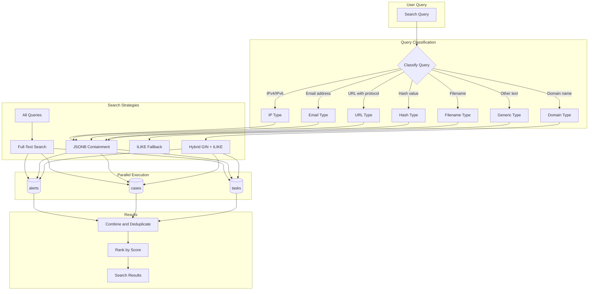
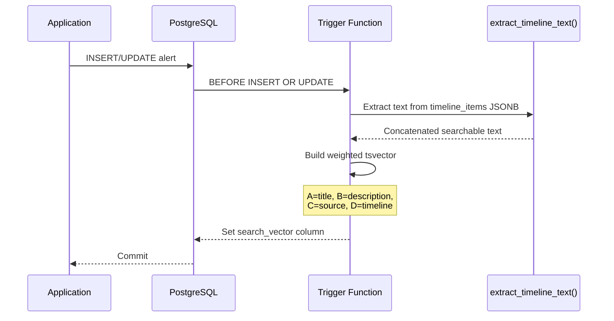
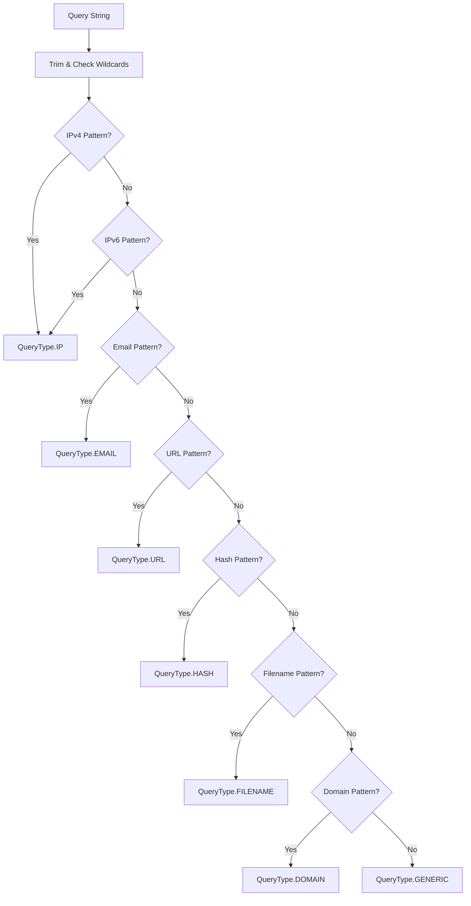
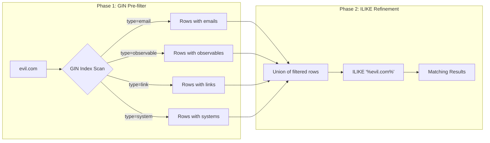
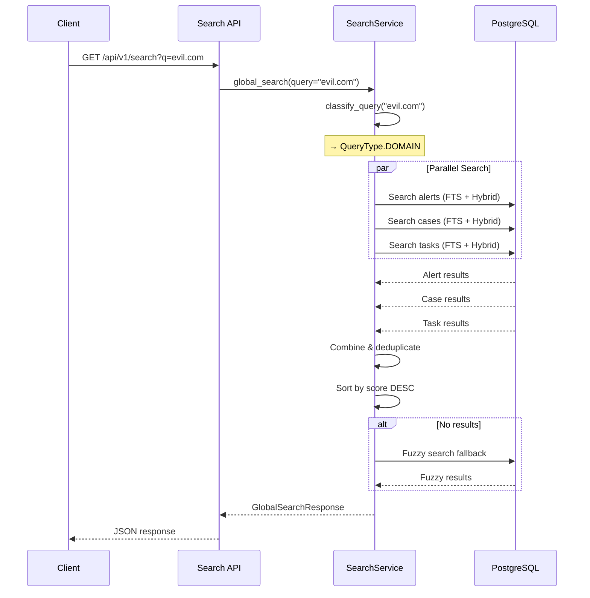

# Search Architecture

This document explains how the unified search system works in Intercept, including the indexing strategy, query classification, and search execution flow.

## Overview

Intercept implements a sophisticated multi-strategy search system that combines:

1. **PostgreSQL Full-Text Search (FTS)** - For natural language queries with weighted ranking
2. **JSONB Containment Queries** - For exact IOC matching with GIN index acceleration
3. **Hybrid GIN + ILIKE** - For domain substring matching within emails/URLs
4. **Fuzzy Search Fallback** - For typo-tolerant queries using `pg_trgm` similarity



## Database Schema

### Search Vector Columns

Each searchable table (`alerts`, `cases`, `tasks`) has a `search_vector` column of type `tsvector`:

```sql
ALTER TABLE alerts ADD COLUMN search_vector tsvector;
ALTER TABLE cases ADD COLUMN search_vector tsvector;
ALTER TABLE tasks ADD COLUMN search_vector tsvector;
```

### GIN Indexes

Three types of GIN indexes accelerate searches:

```sql
-- Full-text search indexes
CREATE INDEX idx_alerts_search_vector ON alerts USING gin(search_vector);
CREATE INDEX idx_cases_search_vector ON cases USING gin(search_vector);
CREATE INDEX idx_tasks_search_vector ON tasks USING gin(search_vector);

-- JSONB containment indexes for timeline items
CREATE INDEX idx_alerts_timeline_gin ON alerts USING gin(timeline_items jsonb_path_ops);
CREATE INDEX idx_cases_timeline_gin ON cases USING gin(timeline_items jsonb_path_ops);
CREATE INDEX idx_tasks_timeline_gin ON tasks USING gin(timeline_items jsonb_path_ops);

-- Trigram indexes for fuzzy search acceleration (pg_trgm)
CREATE INDEX idx_alerts_title_trgm ON alerts USING gin(title gin_trgm_ops);
CREATE INDEX idx_alerts_description_trgm ON alerts USING gin(description gin_trgm_ops);
CREATE INDEX idx_cases_title_trgm ON cases USING gin(title gin_trgm_ops);
CREATE INDEX idx_cases_description_trgm ON cases USING gin(description gin_trgm_ops);
CREATE INDEX idx_tasks_title_trgm ON tasks USING gin(title gin_trgm_ops);
CREATE INDEX idx_tasks_description_trgm ON tasks USING gin(description gin_trgm_ops);
```

## Indexing Pipeline

### Automatic Trigger-Based Indexing

When a record is inserted or updated, PostgreSQL triggers automatically rebuild the `search_vector`:



### Weighted Zones

Content is indexed with different weights to prioritize matches in important fields:

| Weight | Priority | Fields | Boost Factor |
|--------|----------|--------|--------------|
| **A** | Highest | `title` | 1.0 |
| **B** | High | `description` | 0.4 |
| **C** | Medium | `source` (alerts) or `assignee` (cases/tasks) | 0.2 |
| **D** | Low | Timeline item content | 0.1 |

A match in the title will score ~10x higher than a match in timeline content.

### Timeline Text Extraction

The `extract_timeline_text()` function extracts searchable content from timeline items, including nested replies:

```sql
CREATE OR REPLACE FUNCTION extract_timeline_text(items JSONB) RETURNS TEXT AS $$
WITH RECURSIVE all_items AS (
    -- Base: top-level items
    SELECT item FROM jsonb_array_elements(COALESCE(items, '[]')) AS item
    UNION ALL
    -- Recursive: nested replies
    SELECT reply FROM all_items, 
           jsonb_array_elements(item->'replies') AS reply
    WHERE item->'replies' IS NOT NULL
)
SELECT string_agg(
    COALESCE(item->>'observable_value', '') || ' ' ||
    COALESCE(item->>'sender', '') || ' ' ||
    COALESCE(item->>'recipient', '') || ' ' ||
    -- ... all other searchable fields
, ' ') FROM all_items
$$ LANGUAGE SQL IMMUTABLE;
```

#### Extracted Fields

| Category | Fields |
|----------|--------|
| **Observable/IOC** | `observable_value` |
| **TTP/MITRE** | `mitre_id`, `title`, `tactic`, `technique`, `mitre_description` |
| **System** | `hostname`, `ip_address`, `cmdb_id` |
| **Process** | `process_name`, `command_line`, `user_account` |
| **Registry** | `registry_key`, `registry_value`, `old_data`, `new_data` |
| **Network** | `source_ip`, `destination_ip` |
| **Email** | `sender`, `recipient`, `subject` |
| **Files/Links** | `file_name`, `url`, `hash` |
| **Actors** | `name`, `user_id`, `org`, `contact_email`, `tag_id` |
| **Linked Entities** | `assignee`, `task_human_id` |
| **Arrays** | `tags`, `recipients` (flattened to space-separated) |

## Query Classification

Before executing a search, the query is classified to determine the optimal search strategy:



### Classification Patterns

| Type | Pattern | Examples |
|------|---------|----------|
| **IP** | `^\d{1,3}\.\d{1,3}\.\d{1,3}\.\d{1,3}$` or IPv6 | `192.168.1.1`, `::1` |
| **EMAIL** | `^[a-zA-Z0-9._%+-]+@[a-zA-Z0-9.-]+\.[a-zA-Z]{2,}$` | `user@example.com` |
| **URL** | `^https?://[^\s]+$` | `https://evil.com/malware` |
| **HASH** | 32/40/64 hex characters | `d41d8cd98f00b204e9800998ecf8427e` |
| **FILENAME** | Has extension from whitelist | `malware.exe`, `payload.ps1` |
| **DOMAIN** | Valid domain without protocol | `evil.com`, `sub.domain.org` |
| **GENERIC** | Everything else | `phishing attack`, `ransomware` |

## Search Strategies

### 1. Full-Text Search (All Queries)

Every search runs full-text search using `websearch_to_tsquery`:

```sql
SELECT id, title, description, created_at,
       ts_rank(search_vector, websearch_to_tsquery('english', :query)) AS score
FROM alerts
WHERE search_vector @@ websearch_to_tsquery('english', :query)
  AND created_at >= :start_date
  AND created_at <= :end_date
```

**How it works:**
- `websearch_to_tsquery` converts natural language to a tsquery with boolean operator support
- Supports: `AND`, `OR`, `"exact phrases"`, `-negation`
- Falls back to `plainto_tsquery` if syntax is malformed (graceful degradation)
- `@@` operator checks if search_vector matches the query
- `ts_rank` scores results based on match quality and weight zones
- GIN index on `search_vector` makes this fast

**Boolean search examples:**

| Query | Behavior |
|-------|----------|
| `phishing attack` | Matches docs with "phishing" AND "attack" |
| `phishing OR ransomware` | Matches docs with either term |
| `"credential theft"` | Matches exact phrase |
| `malware -benign` | Matches "malware" but NOT "benign" |

### 2. JSONB Containment (IOC Types)

For classified IOC queries, exact containment queries leverage GIN indexes:

```sql
-- For IP addresses
timeline_items @> '[{"type": "system", "ip_address": "192.168.1.1"}]'::jsonb
OR timeline_items @> '[{"type": "network_traffic", "source_ip": "192.168.1.1"}]'::jsonb
OR timeline_items @> '[{"type": "observable", "observable_type": "IP", "observable_value": "192.168.1.1"}]'::jsonb
```

**Field mappings by query type:**

| Query Type | Timeline Item Types & Fields |
|------------|------------------------------|
| **IP** | `system.ip_address`, `network_traffic.source_ip`, `network_traffic.destination_ip`, `observable[IP]` |
| **EMAIL** | `internal_actor.contact_email`, `external_actor.contact_email`, `threat_actor.contact_email`, `email.sender`, `email.recipient`, `observable[EMAIL]` |
| **URL** | `attachment.url`, `ttp.url`, `link.url`, `forensic_artifact.url`, `observable[URL]` |
| **HASH** | `attachment.file_hash`, `forensic_artifact.hash`, `observable[HASH]` |
| **FILENAME** | `attachment.file_name`, `process.process_name`, `observable[FILENAME]` |

### 3. Hybrid Domain Search

Domain queries use a two-phase approach to catch domains within email addresses and URLs:



**Why this is needed:**
- PostgreSQL's English text search config treats `user@evil.com` as a single token
- Searching for `evil.com` does NOT match `user@evil.com` in full-text search
- The hybrid approach first narrows to rows with domain-containing item types (GIN-indexed), then applies ILIKE on the reduced set

```sql
WHERE (
    timeline_items @> '[{"type": "email"}]'::jsonb
    OR timeline_items @> '[{"type": "observable", "observable_type": "DOMAIN"}]'::jsonb
    OR timeline_items @> '[{"type": "observable", "observable_type": "EMAIL"}]'::jsonb
    OR timeline_items @> '[{"type": "observable", "observable_type": "URL"}]'::jsonb
    OR timeline_items @> '[{"type": "link"}]'::jsonb
    OR timeline_items @> '[{"type": "system"}]'::jsonb
    -- ... other domain-containing types
)
AND CAST(timeline_items AS text) ILIKE '%evil.com%'
```

### 4. Fuzzy Search Fallback

If full-text and JSONB searches return zero results, fuzzy search kicks in using `pg_trgm`:

```sql
SELECT id, title, description, created_at,
       GREATEST(
           similarity(COALESCE(title, ''), :query),
           similarity(COALESCE(description, ''), :query) * 0.8
       ) AS score
FROM alerts
WHERE similarity(COALESCE(title, ''), :query) > 0.3
   OR similarity(COALESCE(description, ''), :query) > 0.3
```

This handles typos like `phising` → `phishing` with a similarity threshold of 0.3.

**Performance:** GIN trigram indexes on `title` and `description` columns (`gin_trgm_ops`) accelerate the `similarity()` function, avoiding sequential scans.

## Search Execution Flow



## Snippet Generation

Search results include highlighted snippets showing where matches occurred:

### For Full-Text Matches
Uses `ts_headline` to wrap matches in `<mark>` tags:

```sql
ts_headline(
    'english',
    COALESCE(title, '') || ' ' || COALESCE(description, ''),
    plainto_tsquery('english', :query),
    'MaxWords=25, MinWords=10, StartSel=<mark>, StopSel=</mark>, MaxFragments=1'
)
```

### For JSONB Matches
Returns the full matching timeline item as JSON for frontend rendering:

```sql
SELECT item::text
FROM jsonb_array_elements(timeline_items) AS item
WHERE item::text ILIKE '%' || :query || '%'
LIMIT 1
```

## API Reference

### Endpoint

```
GET /api/v1/search
```

### Query Parameters

| Parameter | Type | Default | Description |
|-----------|------|---------|-------------|
| `q` | string | required | Search query (2-200 chars) |
| `entity_types` | string[] | all | Filter: `alert`, `case`, `task` |
| `start_date` | ISO datetime | -30 days | Start of date range |
| `end_date` | ISO datetime | now | End of date range |
| `limit_per_type` | int | 5 | Max results per entity type (1-20) |

### Response Schema

```typescript
interface GlobalSearchResponse {
  results: SearchResultItem[];
  total_by_type: {
    alert: number;
    case: number;
    task: number;
  };
  query: string;
  date_range: {
    start: string;  // ISO datetime
    end: string;    // ISO datetime
  };
}

interface SearchResultItem {
  entity_type: 'alert' | 'case' | 'task';
  entity_id: number;
  human_id: string;        // "ALT-0000123", "CAS-0000045"
  title: string;
  snippet: string;         // HTML with <mark> tags or JSON
  score: number;           // 0.0 - 1.0
  timeline_item_id: string | null;
  created_at: string;      // ISO datetime
}
```

## Gotchas & Known Limitations

### ⚠️ Email Tokenization

**Problem:** PostgreSQL's `english` text search configuration treats email addresses as single tokens.

```sql
SELECT to_tsvector('english', 'user@evil.com')::text;
-- Result: 'user@evil.com':1
-- NOT: 'user':1 'evil.com':2
```

**Impact:** Searching for `evil.com` via full-text search does NOT match `user@evil.com`.

**Solution:** Domain queries use the hybrid GIN + ILIKE approach instead of relying on full-text search.

### ⚠️ Wildcard Limitations

**Supported:**
- Trailing wildcards in IP addresses: `192.168.*`
- Full wildcards in GENERIC queries: `*malware*` (uses ILIKE)

**Not Supported:**
- Phrase search: `"exact phrase"` (use quotes)
- Boolean operators: `phishing AND ransomware`
- Prefix search in full-text: `mal*` (doesn't work with `plainto_tsquery`)

### ⚠️ Case Sensitivity

- Full-text search is case-insensitive
- JSONB containment is case-sensitive for exact matches
- ILIKE fallback is case-insensitive
- Email/domain queries are normalized to lowercase

### ⚠️ Date Range Default

Searches default to the **last 30 days**. Older records won't appear unless you explicitly set `start_date`.

### ⚠️ New Timeline Item Types

When adding new timeline item types with searchable fields:

1. Update `extract_timeline_text()` function via Alembic migration
2. Add field mappings to `FIELD_MAPPINGS` in `search_service.py` if the new type contains IOCs
3. Add to `DOMAIN_CONTAINING_TYPES` if the type can contain domain strings
4. Rebuild search vectors for existing records: `UPDATE alerts SET updated_at = updated_at;`

### ⚠️ Search Vector Not in SQLModel

The `search_vector` column is **not** defined in SQLModel classes. It's:
- Created and managed at the database level via Alembic migrations
- Populated automatically by PostgreSQL triggers
- Never read or written by the application directly

### ⚠️ Performance Considerations

| Query Type | Index Used | Performance |
|------------|------------|-------------|
| Full-text search | GIN on `search_vector` | ✅ Fast |
| JSONB containment | GIN on `timeline_items jsonb_path_ops` | ✅ Fast |
| Hybrid domain | GIN pre-filter + ILIKE | ⚠️ Good (depends on selectivity) |
| Wildcard/GENERIC | ILIKE on `timeline_items::text` | ❌ Slow (full table scan) |
| Fuzzy fallback | Sequential scan with `similarity()` | ❌ Slow |

For large datasets:
- Avoid leading wildcards: `*malware` is slow
- Prefer specific IOC searches over generic text
- Consider adding `gin_trgm_ops` indexes for frequently-searched text fields

### ⚠️ Fuzzy Search Scope

Fuzzy search only checks `title` and `description` fields—NOT timeline item content. This is intentional to limit performance impact, but means typos in IOC values won't be caught by fuzzy fallback.

## Migrations

### Key Migrations

| Migration | Purpose |
|-----------|---------|
| `001_initial_schema.py` | Initial FTS setup: columns, triggers, GIN indexes |

### Rebuilding Search Vectors

After modifying `extract_timeline_text()`, rebuild all vectors:

```sql
UPDATE alerts SET updated_at = updated_at;
UPDATE cases SET updated_at = updated_at;
UPDATE tasks SET updated_at = updated_at;
```

This triggers the `BEFORE UPDATE` triggers to regenerate `search_vector`.

## Debugging

### Check Query Classification

```python
from app.services.search_service import classify_query
result = classify_query("evil.com")
print(result.query_type)  # QueryType.DOMAIN
```

### Inspect Search Vector Content

```sql
SELECT id, title, LEFT(search_vector::text, 500) 
FROM cases 
WHERE id = 20;
```

### Test Full-Text Match

```sql
SELECT id, title
FROM cases
WHERE search_vector @@ plainto_tsquery('english', 'evil.com');
```

### Check Token Generation

```sql
SELECT plainto_tsquery('english', 'evil.com')::text;
-- Result: 'evil.com'

SELECT to_tsvector('english', 'user@evil.com')::text;
-- Result: 'user@evil.com':1
```

### Explain Query Plan

```sql
EXPLAIN ANALYZE
SELECT * FROM alerts
WHERE timeline_items @> '[{"type": "email"}]'::jsonb
  AND CAST(timeline_items AS text) ILIKE '%evil.com%';
```

Look for `Bitmap Index Scan on idx_alerts_timeline_gin` to confirm GIN index usage.
